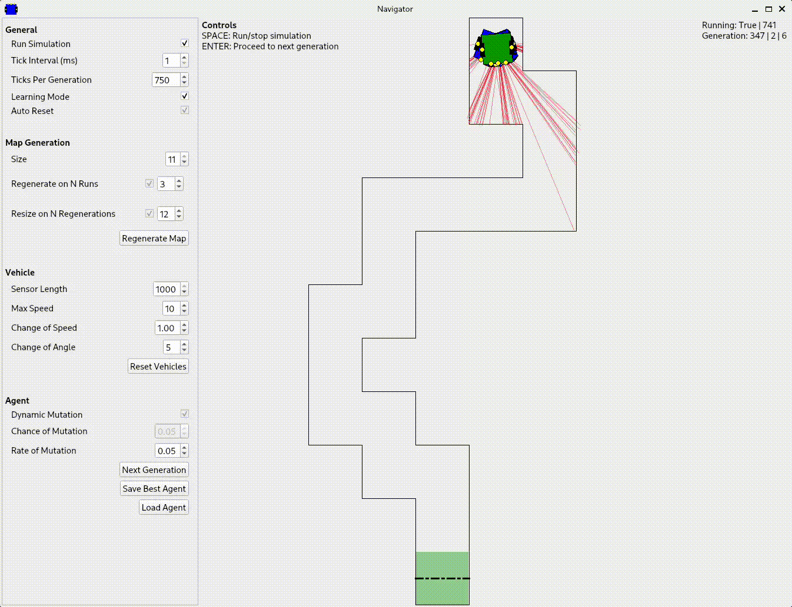

## Description
This project attempts to design and create an intelligent agent that can navigate a vehicle through
an unknown path. This is a coursework that's part my university's computer science module, COMP3071
Designing Intelligent Agents.

## Dependencies
The following are dependencies for the project. The versions mentioned are versions I used to run
the project locally, but it shouldn't be a strict requirement. Though, I'm not sure which specific
versions won't work.

- Python == 3.11.0
- PySide6 == 6.4.2
- numpy == 1.24.2

## Running
1. Clone this project and open it. `git clone https://github.com/izzthedude/COMP3071-Coursework`
2. Ideally, create a virtual environment. `python -m venv venv && source venv/bin/activate`
3. Install dependencies. `pip install -r requirements.txt`
4. Run main.py. `python main.py`
